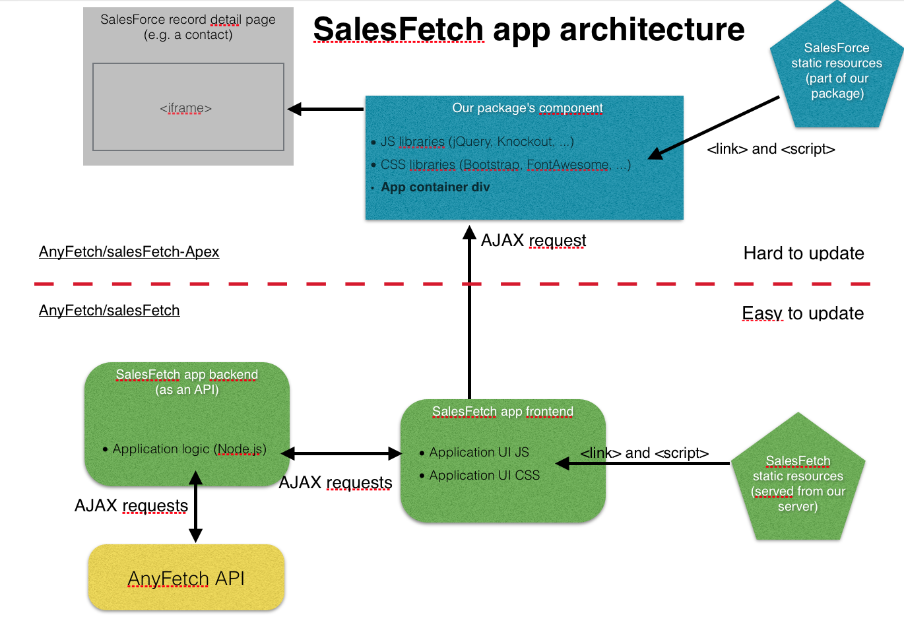

# salesFetch
[](https://travis-ci.org/AnyFetch/salesFetch)
[](https://coveralls.io/r/AnyFetch/salesFetch)
[](https://david-dm.org/AnyFetch/salesFetch)

Fetch API integration in Salesforce.

* Provides components integration in salesforce
* 2 ways : timeline views and search views
* Dynamic request management

Check out the [wiki](https://github.com/Papiel/salesFetch/wiki/Installation-guide) to install salesFetch into you salesforce organization.


## Before...
* Node.js - Download and Install [Node.js](http://www.nodejs.org/download/). You can also follow [this gist](https://gist.github.com/isaacs/579814) for a quick and easy way to install Node.js and npm
* MongoDB - Download and Install [MongoDB](http://www.mongodb.org/downloads) - Make sure it's running on the default port (27017).

### Tools Prerequisites
* NPM - Node.js package manager, should be installed when you install node.js.
* Bower - Web package manager, installing [Bower](http://bower.io/) is simple when you have npm:

```
$ npm install -g bower
$ npm install -g grunt-cli
```

## Quick Install

Install dependencies, all the grunt dependences will be loaded through a post-install script:
```
  $ npm install
```

You shoud now be able to launch the server with:
```
  $ grunt
```

The server in now available on `https://localhost:3000`. The `https` is important for securing the connection between salesFetch and Salesforce, be sure to access a random page first to avoid any problem in salesforce because of the invalid SSL certificate.

## Apex code management
All the apex code is in the repo [salesFetch-Apex](https://github.com/Papiel/salesFetch-Apex).

### With Eclipse (preferred)
You can use [Force.com IDE](https://wiki.developerforce.com/page/Force.com_IDE) directcly integrated into Eclipse IDE. This allows to manage the code, sync it with the dist Salesforce server, and return test into the IDE. More informations in the [introduction](https://wiki.developerforce.com/page/An_Introduction_to_Force_IDE).

### With Sublime Text 3
You can use [MavensMate](http://mavensmate.com/) and the integration into the SublimText3 text editor to manage the Apex code. To connect an existing project to the plugin [use this link](http://mavensmate.com/Plugins/Sublime_Text/Existing_Projects).

### Directly on SalesForce
Log onto http://salesforce.com, then hover over your name and select "Setup". On the left menu, the code will be on "App Setup"

## Architecture

The following (magnificent) diagram explains the architecture of the SalesFetch app. It was designed with performance and maintainability in mind.


